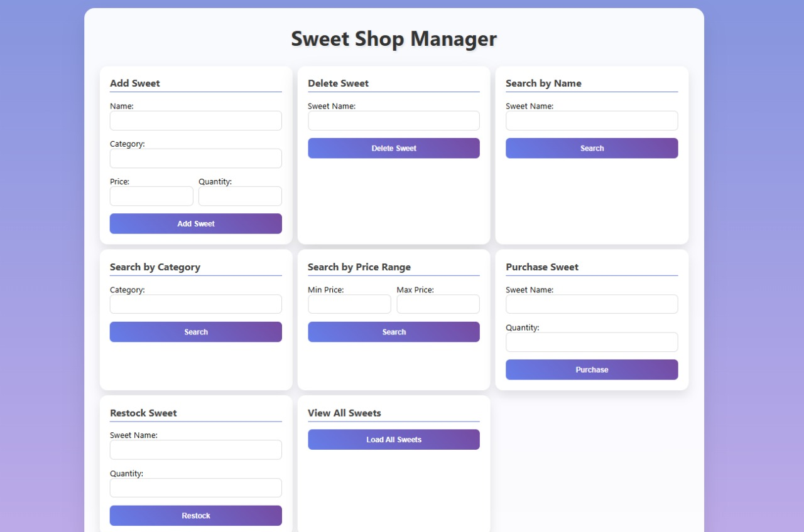
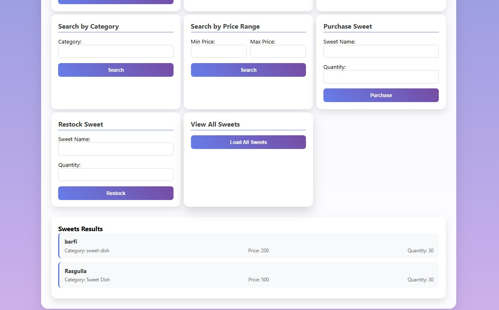

# Sweet Shop Management System

A comprehensive sweet shop management system built with TypeScript (Backend) and vanilla JavaScript (Frontend) that allows users to manage sweet inventory with full CRUD operations and search capabilities.

## 🍭 Features

- **Add Sweet**: Add new sweets to the inventory with name, category, price, and quantity
- **Delete Sweet**: Remove sweets from the inventory by name
- **Search by Name**: Find specific sweets by their exact name
- **Search by Category**: Filter sweets by category (case-insensitive)
- **Search by Price Range**: Find sweets within a specified price range
- **Purchase Sweet**: Buy sweets and automatically reduce inventory quantity
- **Restock Sweet**: Add quantity to existing sweets in inventory
- **View All Sweets**: Display complete inventory

## 🏗️ Project Structure

```
Sweet-Shop-Management-Incubyte/
├── README.md
├── assets/                        # Project screenshots and images
├── Backend/
│   ├── src/
│   │   ├── app.ts                 # Main SweetShop class with business logic
│   │   ├── server.ts              # Express server setup
│   │   ├── routes/
│   │   │   └── sweetRoutes.ts     # API routes
│   │   ├── types/
│   │   │   └── Sweet.ts           # Sweet interface definition
│   │   ├── utils/
│   │   │   └── IdGenerator.ts     # Unique ID generation utility
│   │   └── tests/                 # Comprehensive test suite
│   ├── package.json
│   ├── tsconfig.json
│   ├── jest.config.js
│   └── coverage/                  # Test coverage reports
└── Frontend/
    ├── index.html                 # Main UI
    ├── script.js                  # Frontend logic
    └── style.css                  # Styling
```

## 🚀 Setup and Installation

### Prerequisites
- Node.js (v14 or higher)
- npm

### Backend Setup

1. **Clone the GitHub Repository**
   ```bash
   git clone https://github.com/anshshr/Sweet-Shop-Management-Incubyte
   ```
2. **Navigate to Backend directory**
   ```bash
   cd Sweet-Shop-Management-Incubyte/Backend
   ```

3. **Install dependencies**
   ```bash
   npm install
   ```

4. **Run the server**
   ```bash
   npm run dev
   ```
   The server will start on `http://localhost:3000`

### Frontend Setup

1. **Navigate to Frontend directory**
   ```bash
   cd Frontend
   ```

2. **Open in browser**
   - Open `index.html` in your web browser
   - Or use a live server extension in VS Code
   - Make sure the backend server is running on port 3000

## 🧪 Testing

### Run Tests
```bash
cd Backend
npm test
```

### Run Tests with Coverage
```bash
npm run test:coverage
```

### Watch Mode (for development)
```bash
npm run test:watch
```

## 📊 Test Report

The project includes comprehensive test coverage with **100% code coverage**:

- **Statements**: 18/18 (100%)
- **Branches**: 16/16 (100%)
- **Functions**: 3/3 (100%)
- **Lines**: 17/17 (100%)

### Test Files Coverage:
- [`SweetShop.addSweet.test.ts`](Backend/src/tests/SweetShop.addSweet.test.ts) - Tests for adding sweets
- [`SweetShop.deleteSweet.test.ts`](Backend/src/tests/SweetShop.deleteSweet.test.ts) - Tests for deleting sweets
- [`SweetShop.seacrhByName.test.ts`](Backend/src/tests/SweetShop.seacrhByName.test.ts) - Tests for name search
- [`SweetShop.searchByCategory.test.ts`](Backend/src/tests/SweetShop.searchByCategory.test.ts) - Tests for category search
- [`SweetShop.searchByPrice.test.ts`](Backend/src/tests/SweetShop.searchByPrice.test.ts) - Tests for price range search
- [`SweetShop.purchase.test.ts`](Backend/src/tests/SweetShop.purchase.test.ts) - Tests for purchasing functionality
- [`SweetShop.restock.test.ts`](Backend/src/tests/SweetShop.restock.test.ts) - Tests for restocking functionality
- [`IdGenerator.test.ts`](Backend/src/tests/IdGenerator.test.ts) - Tests for ID generation utility

View detailed coverage report: Open [`Backend/coverage/index.html`](Backend/coverage/index.html) in your browser after running tests.

## 🌐 API Endpoints

| Method | Endpoint | Description |
|--------|----------|-------------|
| POST | `/api/sweets/add` | Add a new sweet |
| DELETE | `/api/sweets/delete` | Delete a sweet by name |
| GET | `/api/sweets/all` | Get all sweets |
| POST | `/api/sweets/search` | Search sweet by name |
| POST | `/api/sweets/category` | Search sweets by category |
| POST | `/api/sweets/price` | Search sweets by price range |
| POST | `/api/sweets/purchase` | Purchase a sweet |
| POST | `/api/sweets/restock` | Restock a sweet |

## 💻 Frontend Screenshots & Demo

### Main Interface
The frontend provides an intuitive card-based interface with forms for all sweet shop operations:






### Key Features:
- **Responsive Design**: Works seamlessly on desktop and mobile devices
- **Real-time Feedback**: Instant success/error messages for all operations
- **Search Results Display**: Dynamic display of search results in organized format
- **Form Validation**: Client-side validation prevents invalid inputs
- **Interactive Cards**: Clean card-based layout for each operation

## 🛠️ Technology Stack

### Backend
- **TypeScript**: Type-safe JavaScript
- **Node.js**: JavaScript runtime
- **Express.js**: Web framework
- **Jest**: Testing framework
- **CORS**: Cross-origin resource sharing

### Frontend
- **HTML5**: Markup
- **CSS3**: Styling with modern features (Grid, Flexbox, Gradients)
- **Vanilla JavaScript**: No frameworks for lightweight performance

## 🎯 Business Logic

The [`SweetShop`](Backend/src/app.ts) class implements all core functionality:

- **Validation**: Comprehensive input validation for all operations
- **Error Handling**: Proper error messages for edge cases
- **Case-Insensitive Search**: Flexible search capabilities
- **Inventory Management**: Automatic quantity tracking
- **Unique ID Generation**: Using [`generateSweetId()`](Backend/src/utils/IdGenerator.ts)

## 🤝 Contributing

### Step 1: Fork and Clone
```bash
# Fork the repository on GitHub first, then clone your fork
git clone https://github.com/your-username/Sweet-Shop-Management-Incubyte.git
cd Sweet-Shop-Management-Incubyte
```

### Step 2: Create a New Branch
```bash
# Create and switch to a new feature branch
git checkout -b feature/your-feature-name

# Or for bug fixes
git checkout -b fix/bug-description
```

### Step 3: Make Your Changes
- Make your code changes
- Add tests for new functionality
- Ensure all existing tests pass
- Follow the existing code style and conventions

### Step 4: Test Your Changes
```bash
# Navigate to Backend and run tests
cd Backend
npm test

# Ensure 100% test coverage is maintained
npm run test:coverage
```

### Step 5: Commit Your Changes
```bash
# Add your changes
git add .

# Commit with a descriptive message
git commit -m "feat: your code description"
```

### Step 6: Push and Create Pull Request
```bash
# Push your branch to your fork
git push origin feature/your-feature-name
```

Then create a pull request on GitHub with a clear description of your changes.

## 📄 License

This project is licensed under the ISC License.

---

**Developer**: Ansh Shrivastav

**Repository**: [Sweet Shop Management System](https://github.com/anshshr/Sweet-Shop-Management-Incubyte)

